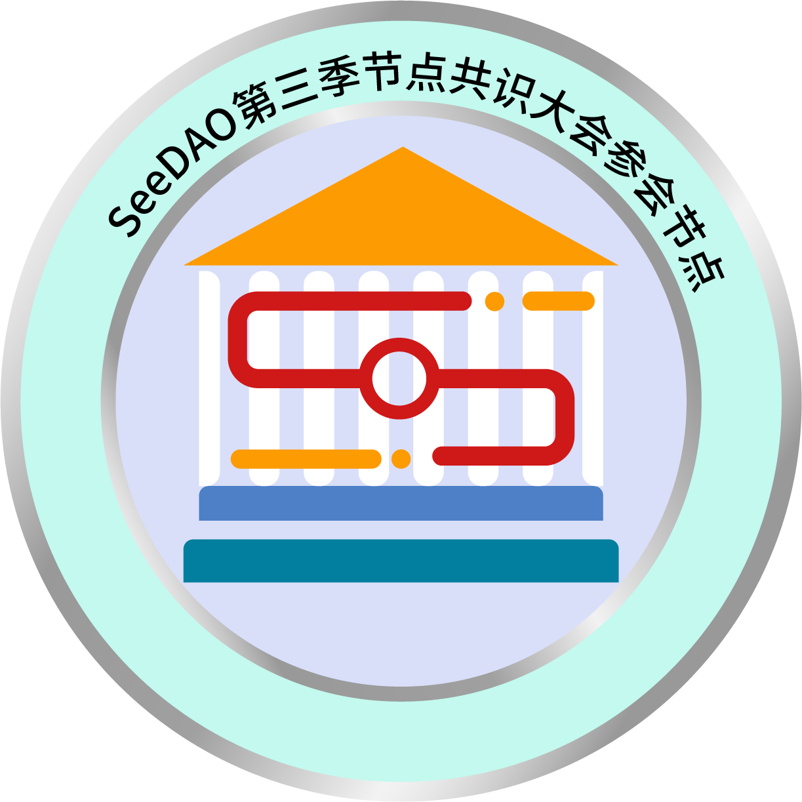

# nodes-sbt-meta

SeeDAO 节点 (Nodes) SBT 的相关信息，包含图像与 Meta json。

## 用处

因为节点合约在开通新一季节点资格时，需要提供新一季节点的图像与相关信息，所以我们将这些信息放在 IPFS 上，以便于节点合约可以直接从 IPFS 上读取，进而让 Opensea 之类的可以解析出节点 SBT 相关信息。

## 节点共识大会前的处理 SOP

1. 打开 `NodeSBT图.ai` 文件，将数字更改为下一季度的中文数字。
2. 输出成 PNG，上传到 IPFS，例如使用 [Pinata](https://pinata.cloud/)
3. 请务必确认 IPFS 的图打的开，例如 [https://ipfs.io/ipfs/QmZ7EHXdLZfdiHbP5PDpyyXGmJUTd7o2hHuDNMpJU5Mp26](https://ipfs.io/ipfs/QmZ7EHXdLZfdiHbP5PDpyyXGmJUTd7o2hHuDNMpJU5Mp26)
3. 取得 IPFS 的链接，在　`meta/` 中创建新的 json，以 `000000000000000000000000000000000000000000000000000000000000000X.json` 命名，其中 X 为数字，请保持档名为 64 位数字，不到就补 0。
4. 随意挑一个 meta 中的 json 复制内容，并修改相应的文字：
```json
{
    "name": "SeeDAO Season1 Node", // <-------------1 改成 N
    "description": "SeeDAO 第一季节点身份证明", // <-------------一 改成 某某
    "image": "https://ipfs.io/ipfs/QmZ7EHXdLZfdiHbP5PDpyyXGmJUTd7o2hHuDNMpJU5Mp26",　// <-------- 贴上新的节点图 IPFS 位址
    "external_url": "https://seedao.xyz"　// <--- 保持不变
}
```
5. 将整个 `meta/` folder 上传到 IPFS，例如继续使用 [Pinata](https://pinata.cloud/)。
6. 将 folder 的 IPFS 地址给予协助开通节点资格的人员，往常是 Alex，他会让节点SBT合约的meta信息指向你给的位址。

## 图像

范例图像请见 [images](images) 目录



## JSON

每一个 josn 的格式都大抵如下：

```
{
    "name": "SeeDAO Season1 Node",
    "description": "SeeDAO 第一季节点身份证明",
    "image": "https://ipfs.io/ipfs/QmZ7EHXdLZfdiHbP5PDpyyXGmJUTd7o2hHuDNMpJU5Mp26",
    "external_url": "https://seedao.xyz"
}
```
